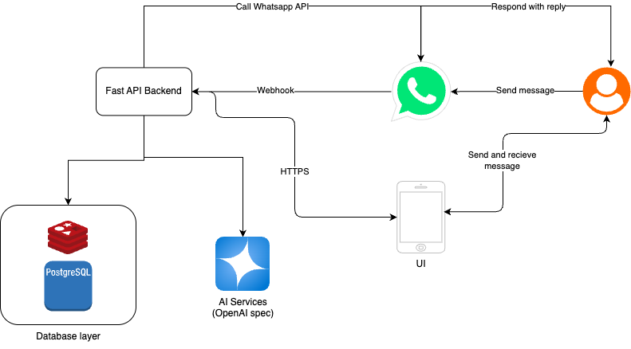

# 📘 High-Level Design (HLD)

## 1. Introduction

The **SymptomSync** is a conversational AI system that streamlines the patient
intake process before medical consultations. It interacts with users over
**WhatsApp** and **web UI**, gathers structured data, stores relevant context,
and provides a summarized output for healthcare professionals. This document
captures the architecture, data flow, component responsibilities, and key design
considerations.

---

## 2. Architecture Overview

---

## 3. Key Components

### 3.1 FastAPI Backend

* **Role**: Core orchestrator of the entire application logic.
* **Responsibilities**:

  * Receives incoming messages via WhatsApp webhook
  * Maintains user session and context
  * Queries/stores information from PostgreSQL and Redis
  * Orchestrates AI prompt construction and response handling
  * Sends replies back via WhatsApp API

### 3.2 WhatsApp Integration

* **Role**: Primary communication interface with the patient
* **Responsibilities**:

  * Receives and sends patient messages
  * Invokes webhook on new messages
  * Responds with AI-generated replies or appointment options

### 3.3 Database Layer

* **Technologies**: PostgreSQL + Redis
* **Responsibilities**:

  * PostgreSQL stores patient profiles, intake data, appointment records
  * Redis (optional): caches active sessions for quick lookup and LLM context

### 3.4 AI Services (OpenAI Spec)

* **Role**: Processes patient responses using LLMs
* **Responsibilities**:

  * Generates intelligent follow-up questions
  * Summarizes patient inputs into structured JSON
  * Applies prompt-based safety rules and filters
  * Does **not** perform any medical diagnosis

### 3.5 UI (Mobile/Web)

* **Role**: Alternative interface for patient interaction
* **Responsibilities**:

  * Sends and receives messages via HTTPS
  * Visual UI for scheduling, uploading files, viewing summaries

---

## 4. Data Flow Description

### Step-by-Step Flow:

1. **User Sends Message** via WhatsApp or Web UI
2. **WhatsApp Webhook** triggers a request to the FastAPI backend
3. **FastAPI Backend**:

   * Identifies user session
   * Retrieves patient history or initializes new session
   * Sends message to **AI Services** with patient context
4. **AI Services**:

   * Parses message
   * Generates next question or summary output
   * Sends response to backend
5. **Backend**:

   * Stores message and response
   * Sends reply back through **WhatsApp API**
6. **Doctor/Admin Access** (Optional in P2):

   * Gets structured intake summary from the database
   * Reviews responses, adds notes, and initiates follow-up steps

---

## 5. Component Integration

| Component              | Interface             | Protocol | Integration Details            |
| ---------------------- | --------------------- | -------- | ------------------------------ |
| FastAPI ↔ WhatsApp API | REST API/Webhooks     | HTTPS    | Facebook Graph API             |
| FastAPI ↔ Database     | SQL/ORM               | TCP      | PostgreSQL for persistent data |
| FastAPI ↔ AI Services  | OpenAI-compatible API | HTTPS    | Prompt → Response              |
| FastAPI ↔ UI           | REST API              | HTTPS    | JSON-based request/response    |

---

## 6. Design Considerations

### 6.1 Guardrails & Safety

* Prevent AI from giving diagnosis using rule-based + LLM filters
* All responses conclude with "Doctor will review this"
* Logs monitored for safety violations
* Escalation policy if flagged inputs detected

### 6.2 Session Management

* Redis used to persist short-term memory across message threads
* PostgreSQL for long-term conversation and medical history

### 6.3 Scalability

* Stateless FastAPI instances behind load balancer
* Asynchronous webhook and message processing
* AI service calls are async and retry-capable

### 6.4 Security

* Data encryption in transit and at rest
* OAuth2 for user authentication
* Token-based WhatsApp auth binding

---
